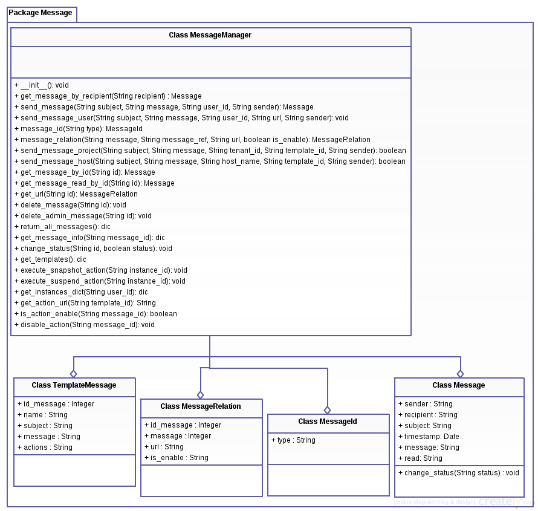

Documentação do Telemetry
=========================
* * *

*   [Sumário](#)
    *   [OpenStack](#openstack)
    *   [Horizon](#horizon)
    *   [Analytics](#analytics)
    *   [Funcionalidades](#funcionalidades)
        *   [Benchmarking](#benchmarking)
        *   [Host](#host)
        *   [Collector](#collector)
        *   [Banco de dados](#bancodedados)
        *   [Alarmes](#alarmes)
        *   [Mensagens](#mensagens)

* * *

<h2 id="openstack">OpenStack</h2>
OpenStack é um software que administra grandes quantidades de computadores no que se diz respeito a armazenamento e conexão a recursos em um datacenter, administrado através de um dashboard ou via API. OpenStack trabalha com populares companhias e utiliza tecnologias open source tornando-o assim ideal para infraestruturas heterogeneas.
Centenas de grandes companhias por todo o mundo confiam no OpenStack para rodarem seus serviços todo dia, reduzindo custos e ajudando eles a avançarem rapidamente. O OpenStack possui um forte sistema e usuários que podem escolher dentre os mais diversos produtos e serviços oferecidos. 
O software é desenvolvido por uma comunidade de desenvolvedores em colaboração com os usuários.

<h2 id="horizon">Horizon</h2>
O Horizon é uma implementação canonica de um Dashboard do OpenStack que prove uma interface web baseada no usuário que através do OpenStack disponibiliza serviços como a criação de maquinas virtuais, projetos, gerenciamento de usuários, etc.

<h2 id="analytics">Analytics</h2>
Ao utilizar analytics e nuvem juntos algumas perguntas surgem em nossas mentes:
Como usar analytics para auxiliar na gerência de uma infraestrutura de computação em nuvem? Como auxiliar o administrador da infraestrutura a gerenciar recursos de forma otimizada? Como auxiliar o usuário, por exemplo, a entender sua demanda por servidores e a planejar seu consumo?
Em vista de perguntas como essa surgiu o telemetry, um projeto no qual se tem em vista ajudar tanto o administrador quanto os usuários de uma cloud provendo diversas funcionalidades que os ajudarão a melhor gerir seus recursos e ajuda-los a tomar decisões mais acertadas.

<h2 id="funcionalidades">Funcionalidades</h2>

<h3 id="benchmarking">Benchmarking</h3>
Desenvolvida para avaliar o desempenho dos compute nodes e possibilitar a comparação entre eles. De fato, é comum em uma nuvem heterogênea se ter máquinas de diferentes gerações, por isso uma avaliação/comparação poderia assegurar um desempenho mínimo da nuvem, por exemplo. 
Para o benchmark, três avaliações são realizadas. A primeira avalia CPU por meio do cálculo da função de fibonacci para a posição 500000; A segunda avaliação testa a memória por meio de concatenação de strings, concatenamos a string “a” que tem o tamanho de um byte 8192000 resultando em um total de 7,8mb de memoria ocupada pela string resultante; Finalmente, a terceira avaliação examina o de disco ao criar alguns arquivos, fazer escritas e leituras nesses arquivos e depois removê-los, são utilizados 65536 arquivos e são gravados neles 4k de dados.; Os testes são realizados várias vezes para possuírem poder estatístico.
O diagrama abaixo descreve as atividades realizadas para a execução do benchmaking:

<h3 id="host">Host</h3>
O componente ceilometer dispõe apenas de formas de monitoramento para máquinas virtuais. Em se tratando de compute nodes, o ceilometer não provê formas de monitoramento. Para preencher essa lacuna, implementamos um sistema de coleta de métricas para hosts utilizando o psutil (biblioteca existente em [python](https://pypi.python.org/pypi/psutil "Psutil")) e através do qual é possível obter dados sobre a utilização de cpu, memória, disco e network. Também implementamos uma forma de obter dados sobre a disponibilidade dos serviços oferecidos pelo host analisado. Todos esses dados sobre host podem ser visualizados em gráficos em nossa interface do telemetry no horizon.

<h3 id="collector">Collector</h3>
Para o monitoramento dos serviços foi criado um collector ao qual tem a tarefa de perguntar a cada host se os serviços oferecidos por ele estão funcionando e após receber a resposta do host(também há a possibilidade do host não responder caso isso aconteça existe um timeout que ao ser ultrapassado é considerado que todos os serviços daquele host pararam) ele envia os dados para serem salvos em um host responsável pelo banco de dados.
Um pequeno diagrama que ilustra o comportamento descrito acima pode ser observado logo abaixo:

<h3 id="bancodedados">Banco de Dados</h3>
A tabela que guarda os dados dos hosts tem seus campos descritos abaixo:

<h3 id="alarmes">Alarmes</h3>
Essa funcionalidade permite que o administrador crie alarmes de forma rápida e fácil para uma instância específica ou para um conjunto de máquinas, além de ser possível a visualização de alarmes em tabela do histórico de alarmes.

<h3 id="mensagens">Mensagens</h3>
Existem situações em que o administrador da cloud deseja mandar avisos para seus usuários e nem sempre os meios disponíveis, como e-mail por exemplo, são tão eficientes quando deveriam, pois o usuário pode não ver o e-mail ou não acessa-lo, etc. Pensando nisso foi implementado no telemetry um sistema de mensagem que permite o administrador enviar uma mensagem para um usuário em específico ou para um conjunto deles. Os usuários por sua vez ao acessarem o horizon com suas contas verão notificações de mensagens enviadas para eles e podem le-las, mantendo-os assim informados.
Abaixo podemos ver um diagrama uml contendo os serviços oferecidos:

